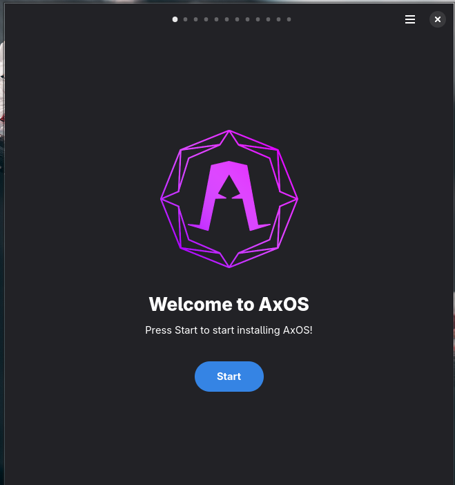
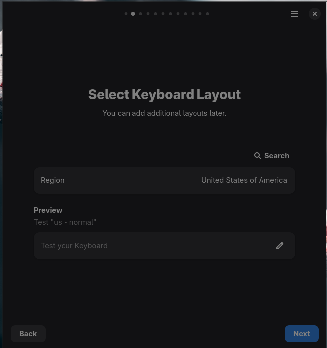
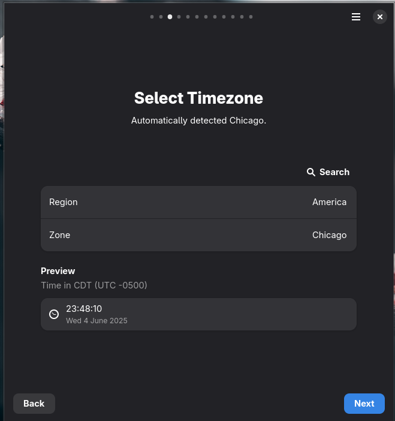
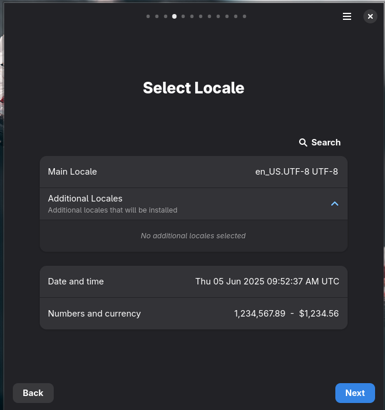
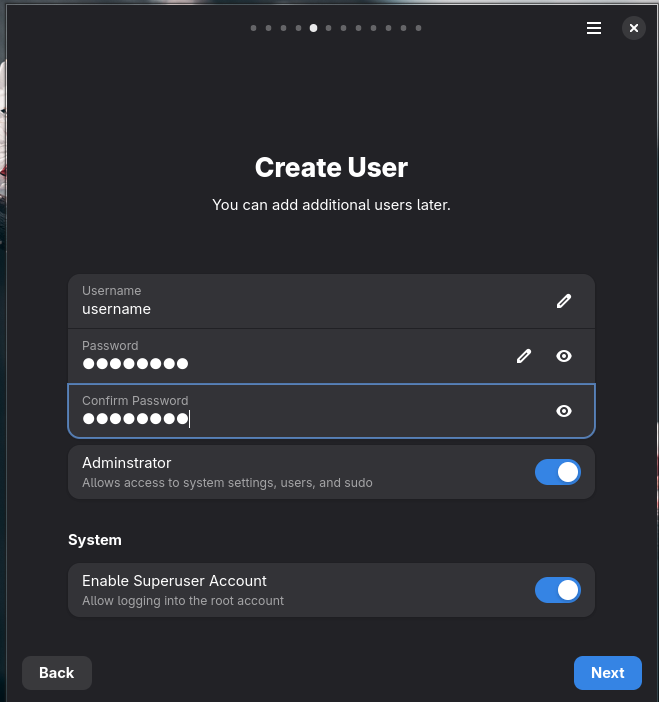
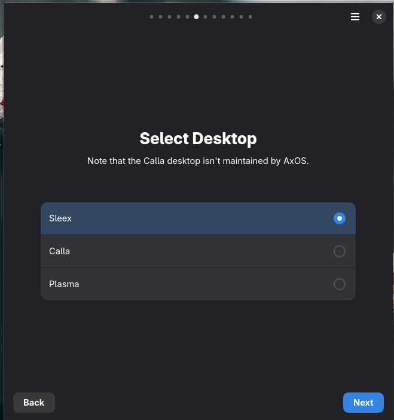
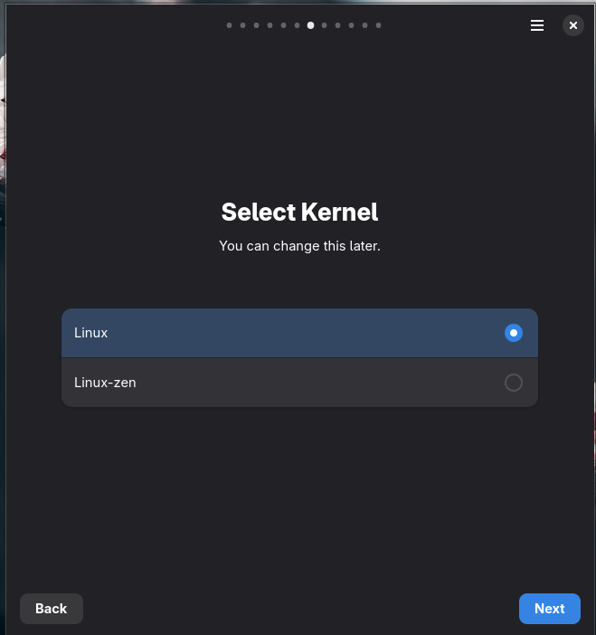
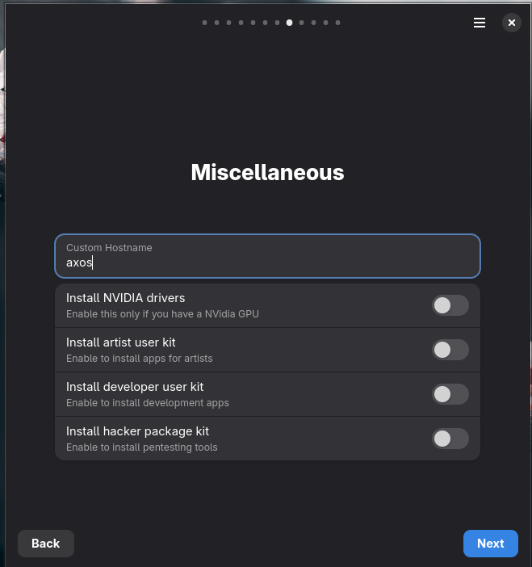
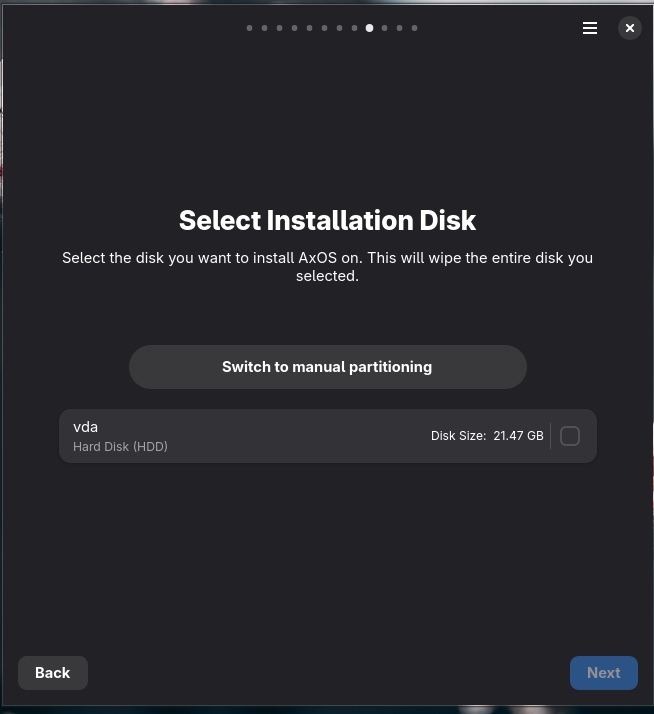

So, you are ready to install AxOS? Great! This guide will help you to install AxOS on your computer.

## Prerequisites

### Required

| Component  | Plasma          | Calla           | Sleex           | Theom           |
| ---------- | --------------- | --------------- | --------------- | --------------- |
| CPU        | 64-bit (x86_64) | 64-bit (x86_64) | 64-bit (x86_64) | 64-bit (x86_64) |
| RAM        | 4GB             | 2GB             | 4GB             | 2GB             |
| Disk Space | 10GB            | 10GB            | 10GB            | 10GB            |

### Recommended

| Component  | Plasma | Calla | Sleex | Theom |
| ---------- | ------ | ----- | ----- | ----- |
| RAM        | 8GB    | 4GB   | 8GB   | 4GB   |
| Disk Space | 50GB   | 20GB  | 40GB  | 20GB  |

<br />

**AxOS doesn't support 32 bits and ARM architectures.** If you are using a 32 bits or ARM architecture, you won't be able to install AxOS.

**Secure boot is not supported** and **YOU WON'T BE ABLE TO BOOT WITHOUT UEFI**.

**Support for virtual machine architectures is partially implemented and the time needed for the installation process may vary. We recommend an actual hardware installation for various reasons. Otherwise, try out the LIVE environment before installing, it is a point in time release using the desktop environment, Sleex.**

## Create the installation media

The installation media must be a USB drive or an SD card. You must have at least **2GB** of free space. This number may change with subsequent releases.

### Get the ISO

The ISO (or .iso) is the installation image of AxOS. You can download it from the [AxOS release page](https://github.com/axos-project/axos/releases/latest). Please ensure you have the latest ISO, previous ISOs will often have installation issues with the evolution of the Arch ecosystem.

### Flash the ISO to the installation media

There are three ways to create the installation media:

**On Linux/MacOS:**

Your mileage may vary with different image-writing applications (just as all other distro experience). Ventoy also works at the time of this writing.

You can either use the **Balena Etcher** app or the **dd** command.

```bash
sudo dd if=/path/to/axos.iso of=/dev/sdX bs=4M status=progress && sync
```

Be aware that careless application of this command can and will likely eat your hard drive.

Be sure to replace `/path/to/axos.iso` with the actual path to the ISO file on your system and `/dev/sdX` with the actual path to the USB drive or SD card on your system.
You can find the path to the USB drive or SD card by running `lsblk` or `fdisk -l`.

**On Windows:**
You can use the **Rufus** app or the **Balena Etcher** app. You can also use the **dd** command, but it's not recommended because it's more difficult to use.

## Start the installation

If you have the installation media ready, you can start the installation.

### Boot from the installation media

1. Plug the installation media into your computer while it's powered off. This may mean inserting it into a slot or attaching via USB.
2. Access the boot menu of your computer. The key to access the boot menu varies from one computer to another, but it's usually **F2**, **F10**, **F12**, **Delete**, **Esc**, or **F1**.
3. Select the installation media as the boot device.

You should now boot to the live AxOS environment. The live environment is a testing environment, so you can try AxOS without having to install it. By default, the live environment is the **Sleex** desktop environment.

You should now see this screen (or very similar).


## Install AxOS

Are you ready to install AxOS? Great! The install app should automatically start, otherwise you can find it in the app menu with the name **Install AxOS**. This app will guide you through the installation process. Use the super key (Windows key) to activate the search menu if needed.


### Step-1: Choosing layout

Choose your preferred keyboard layout.



### Step-2: Time zone

Select your timezone.



### Step-3: Locale and date

Set the system locale and date settings ([beware of this issue](https://www.axos-project.com/docs/reference/issues/#greyed-out-next-button-in-locale-screen-in-axos-installer)).



### Step-4: Creating user account

Create user account with username, password, and admin rights.



### Step-5: Choose your desktop

Choose your desktop between Plasma, Calla, Theom or Sleex. See what they are [in the dedicated desktops tab](/docs/reference/desktops/)



### Step-6: Kernel

Choose between Linux or Linux-zen kernel. The Linux kernel aims for stability and the zen focuses on the performances, but is less stable.



### Step-7: Drivers, Optional packages, Swap

Configure NVidia drivers, optional app packages and your desired swap size(screenshot outdated).



### Step-7: Installation disk and partitioning

Choose installation disk and partitioning method.



### Step-8: Validation

Verify selections and begin installation.

Take a look at the choices you've made, validate everything, and then start the installation. The installer will fetch the latest packages and install them in the selected disk. This process can take a few minutes, depending on the speed of your disk and internet connection.

## Conclusion

You have now installed AxOS! You can now reboot your computer and enjoy your new operating system.
