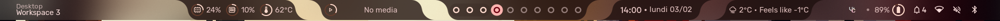
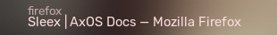
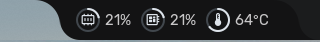
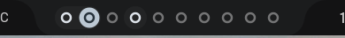
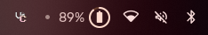
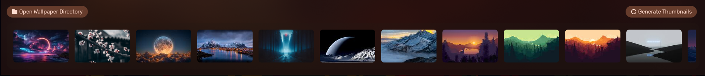
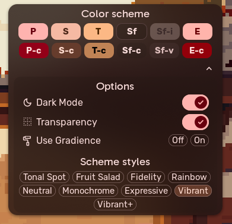
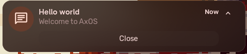
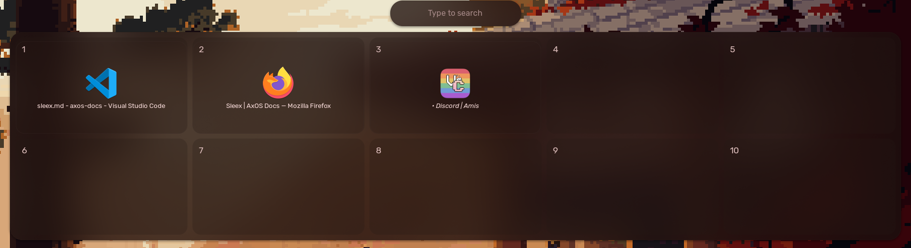

Sleex (based on Hyprland) is the third desktop environment for AxOS. It is the most aesthetic and feature-rich desktop environment of the 3. It has a lot of features, smooth animations and a lot of cool stuff, but it is also the least stable.

In this page, you will learn how to use Sleex, how to customize it and how to fix some common issues.

## Installation

When installing AxOS, you can choose Sleex as your desktop environment. If you didn't choose it during the installation, you can install it by running the following command:

```bash
epsi i sleex
```

or

```bash
epsi install sleex
```

You can also install it with pacman.

## Keybinds

Like Calla, it is a tiling window manager, so you can manage your windows with a keyboard. It is also better if used with keybindings, so you can manage your windows with a keyboard. You can find them by pressing `Super + F1`. If you need, you can change these keybindings by editing the `~/.config/hypr/hyprland/keybinds.conf` file.

The configuration method can be found in the [Hyprland documentation](https://wiki.hyprland.org/Configuring/Binds/)

Here are the built-in keybinds:

**Essentials:**
| Keybind | Action |
|---------|--------|
| `Super + F1` | Show keybinds |
| `Super` | Open the overview / launcher |
| `Super + T` | Change the wallpaper |
| `Super + Ctrl + T` | Chose wallpaper from file |

**Actions:**
| Keybind | Action |
|---------|--------|
| `Super + V` | Clipboard history |
| `Super + Semicolon` | Emoji picker |
| `Ctrl + Alt + Delete` | Logout menu |
| `Super + Shift + S` | Screenshot region (clipboard) |
| `Super + Shift + Alt + S` | Screenshot region (with edit) |
| `Super + Shift + T` | Screen snip to text |
| `Super + Shift + X ` | Color picker |
| `Print` | Screenshot (clipboard) |
| `Ctrl + Print` | Screenshot (clipboard and file) |
| `Super + Alt + R` | Record region (no sound) |
| `Ctrl + Alt + R` | Record screen (no sound) |
| `Super + Alt + Shift + R` | Record screen (with sound) |

**Session:**
| Keybind | Action |
|---------|--------|
| `Super + L` | Lock screen |

**Window management:**
| Keybind | Action |
|---------|--------|
| `Super + ←/↑/→/↓` | Move focus in direction |
| `Super + Q` | Close window |
| `Super + Shift + Alt + Q` | Pick and kill window |

**Window Arrangement:**
| Keybind | Action |
|---------|--------|
| `Super + Alt + Space` | Toggle floating |
| `Super + F11` | Toggle fake fullscreen |
| `Super + LMB` | Move window |
| `Super + RMB` | Resize window |

**Workspace navigation:**
| Keybind | Action |
|---------|--------|
| `Super + 1-9` | Switch to workspace |
| `Ctrl + Super + ←/→` | Move to previous/next workspace |
| `Super + PageUp/PageDown` | Move to previous/next workspace |
| `Super + Scroll` | Move to previous/next workspace |

**Workspace management:**
| Keybind | Action |
|---------|--------|
| `Super + Ctrl + 1-9` | Move window to workspace |
| `Super + Shift + Scroll` | Move window to previous/next workspace |

**Widgets:**
| Keybind | Action |
|---------|--------|
| `Ctrl + Super + Alt + R` | Reload widgets |
| `Ctrl + Super + F2` | Change bar type |
| `Super` | Open the overview / launcher |
| `Super + KP_left` | Open left panel |
| `Super + KP_down` | Open the dashboard |
| `Super + T` | Change the wallpaper |
| `Super + F1` | Show keybinds |
| `Super + M` | Toggle music controls |

**Apps:**
| Keybind | Action |
|---------|--------|
| `Super + Enter` | Open terminal |
| `Super + W` | Open web browser |image
| `Super + E` | Open file manager |
| `Super + Z` | Open Zed editor |
| `Super + C` | Open Visual Studio Code |
| `Super + X` | Open Mousepad |
| `Super + I` | Open Settings |
| `Super + Ctrl + V` | Open Pavucontrol (audio settings) |
| `Super + Shift + Escape` | Open System Monitor |

## Widgets

Sleex has a built-in widget system. You can add, remove and change the code of these in `/usr/share/sleex/modules/`. You can also add your own widgets by creating a new file in this folder and editing `/usr/share/sleex/config.js`.

### Bar

The bar is the top bar of Sleex. Several modules can be found on it.



| Description                                                                                                                                                                                                                                                     | Screenshot                                               |
| --------------------------------------------------------------------------------------------------------------------------------------------------------------------------------------------------------------------------------------------------------------- | -------------------------------------------------------- |
| The Title module shows the name of the current focused window. The top part is the name of the process and the big bottom part is the title of the window. |             |
| The monitoring module shows the CPU usage, RAM usage and CPU temperature.                                                                                                                                                                                       |   |
| The Workspace module shows the workspaces (wow, what a surprise). The focused workspace is highlighted. Used workspaces are shown in white, unused workspaces are shown in grey. Click on a workspace to switch to it. You can also scroll to change workspace. |     |
| The Time Date module shows the current time and date. Click on it to open the dashboard.                                                                                                                                                                        |      |
| The system trays and system icons are shown in the right part of the bar. Click to open the dashboard.                                                                                                                                                          |  |

### Dashboard

The dashboard is a widget with several modules. You can open it by clicking on the Time Date module in the bar, or by pressing `Super + KP_down`.


#### Home tab
In the home tab, you will find simple display elements:
- **User greeting**, because we are polite. You must set the profile icon in `/var/lib/AccountsService/icons/<your_name>` with no extension.
- **Clock**. Well, do I need to explain ?
- **Contribution number** using the github API. There is currently no way to change the username without changing this file: `/usr/share/sleex/modules/dashboard/widgets/github.js`
- **Notification center** with the list of notifications. Click on the arrow to expand them. There is also a button to enable DnD, so you won't get a notification popup.
- **Music controller** to control the music. Surprising, isn't it ?
- **Weather module** based on your current location according to your public IP.
- **Calendar** that doesn't do much...
- **Quote** to be inspired.

#### Settings tab
This tab has quick settings:
- **Effect settings** to modify Sleex's effects such as blur or transparency
- **Developer options** that can be useful for debugging Sleex
- **Customisation** to edit the elements of the bar
- **Bluetooth** to connect and manage your bluetooth devices
- **Wifi** to manage your WiFi connexions
- **Audio control** to manage your audio input/outputs and change the sound level of each running apps

#### Todo tab
It's a simple todo list, nothing more nothing less

#### APIs tab
Here, you will find AI assistants. The default agent is Gemini, but in the second section of this tab, you can chose more assistants. 

The output supports Markdown and LaTeX (maths).

#### Updates tab
This tab is for updating Sleex.
The left secion has a simple box with the current version and a update button.
The right section shows the last 5 commits made in the Sleex github repo
*Note that a new commit doesn't mean an available update*


### Others

You can also find the following widgets:

| Description                                                                                                                                                                                                                                                                                                                        | Screenshot                                                 |
| ---------------------------------------------------------------------------------------------------------------------------------------------------------------------------------------------------------------------------------------------------------------------------------------------------------------------------------- | ---------------------------------------------------------- |
| The wallpaper module allows you to change the wallpaper. If no wallpapers appears, click "Generate thumbnails". You can add or remove wallpapers from the list by clicking "Open wallpaper directory". This directory is located in `~/.sleex/wallpapers/`. The chosen wallpaper will also change the global colors of the system. |         |
| The color config popup allows you to change the color schemes and other color related settings. Note that you can't change every colors here and you have to use the gradience app to change system colors.                                                                                                                        |          |
| The notifications popup shows the notifications. You can slide them to dismiss them, open the details with the arrow and click on the buttons when maximized. Critical notifications are shown in red.                                                                                                                             |  |
| The overview shows the opened apps and in which workspace they are. You can manage them by clicking or moving them. You can type from there to search apps, search on the web, do a math operation or asking gemini.                                                                                                               |            |

## Developers

You want to contribute to the developement of Sleex? Cool! here are some things you might want to know:

- The code of sleex is located in `/usr/share/sleex/`. You can also find it on the github repository: [Sleex](https://github.com/AxOS-project/sleex)
- The Sleex interface and widgets are made with [AGS v1](https://github.com/Aylur/ags/tree/v1).

Pull requests are welcome! If you have any question, you can ask them on the [AxOS Discord server](https://discord.com/invite/xQdtDBFmsy).
