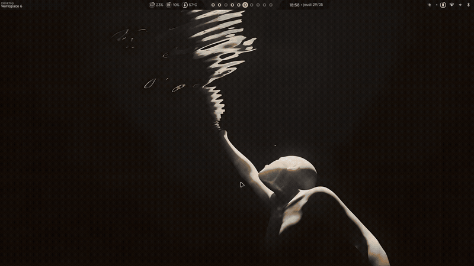
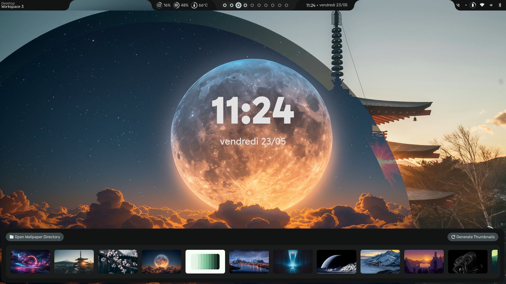
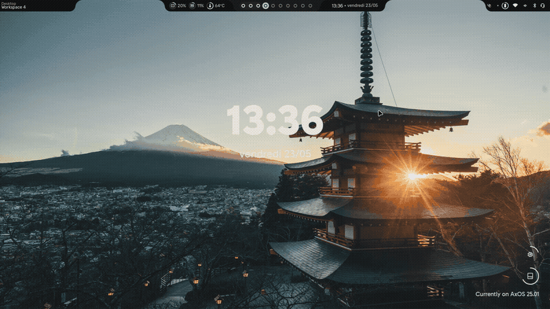
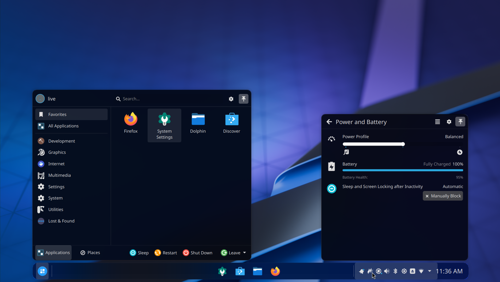
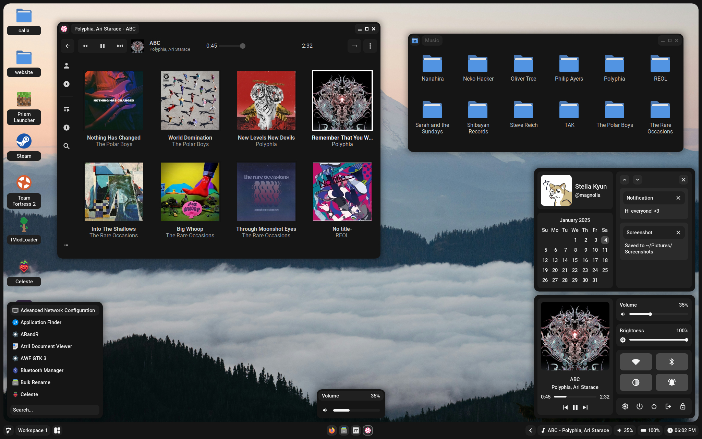
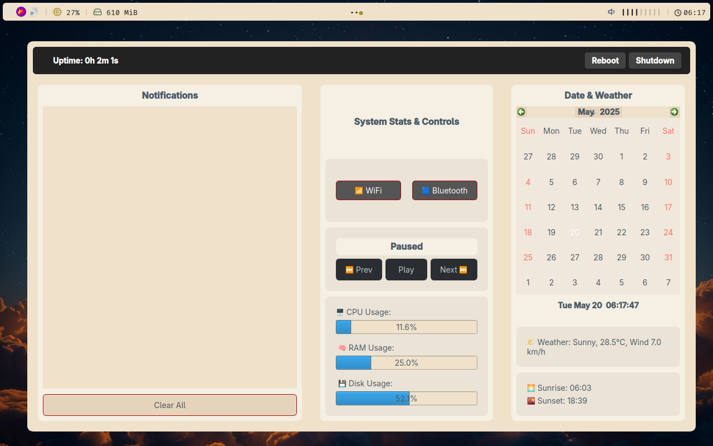
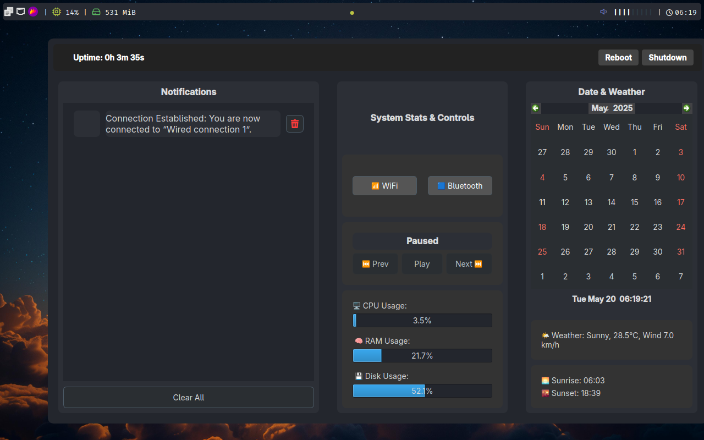
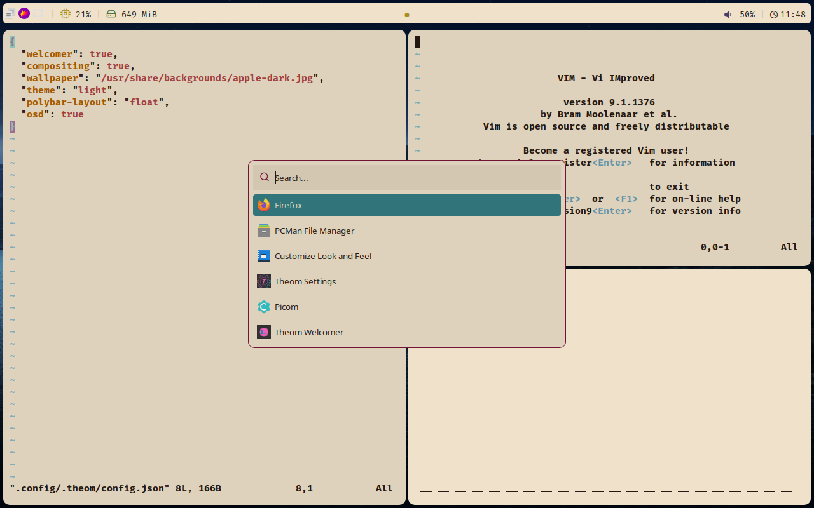
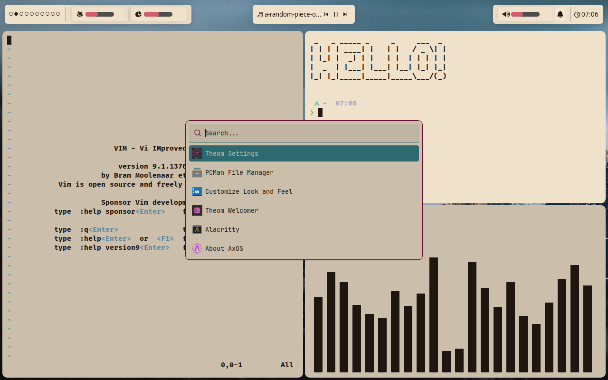
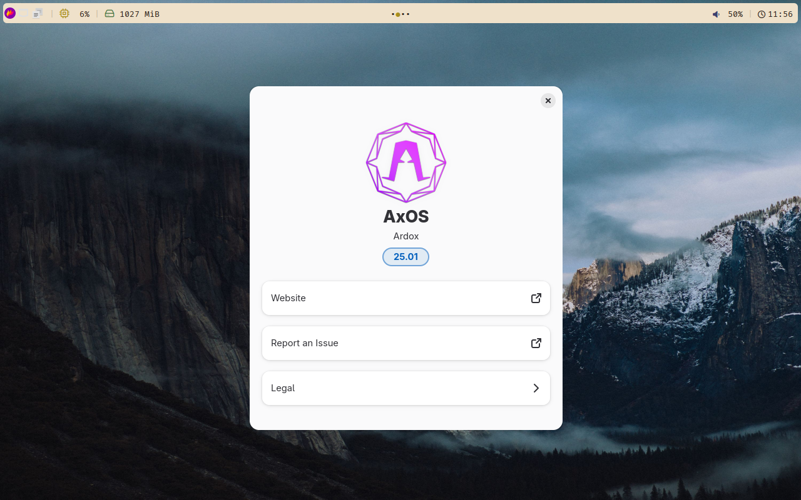

AxOS has 4 default desktops. Learn more about them in this reference page.

## Sleex

Sleex (based on hte Hyprland compositor) is the third and primary desktop environment for AxOS. It is the most aesthetic and feature-rich desktop environment of the 3. It has a lot of features, smooth animations and a lot of cool stuff, but it is also the least stable.

Like Calla, it is a tiling window manager, so you can manage your windows with a keyboard. It is also better if used with keybindings, so you can manage your windows with a keyboard. You can find them by pressing `Super + F1`. If you need, you can change some settings (including keybindings) by editing files in `.config/hypr/hyprland/` folder. You can change the wallpaper by pressing `Super + T`.

**By default, the keyboard layout is set to US QWERTY, no matter what you chosed in the installation. You can change it by editing the `.config/hypr/custom/general.conf` file according to `.config/hypr/hyprland/general.conf`**. Note that if you edit the files in the `hyprland` directory, the settings will be reset in the next update.

| Pros               | Cons                           |
| ------------------ | ------------------------------ |
| Aesthetic          | Less stable                    |
| Feature-rich       | Less user-friendly than Plasma |
| Resource-efficient |                                |
| Tiling             |                                |
| User-friendly      |                                |

## Plasma

Plasma (or KDE Plasma) is the first desktop environment for AxOS. It is a powerful, user-friendly, stable and customizable desktop environment.

As it is a very known and active desktop environement, you can find everything you need on Internet.

| Pros              | Cons                                |
| ----------------- | ----------------------------------- |
| Active community  | Not the most resource-efficient     |
| Very customizable | Not the most aesthetic and original |
| Stable            |                                     |
| User-friendly     |                                     |

## Calla

Calla (made by [Stardust-kyun](https://github.com/Stardust-kyun)) is the second desktop environment for AxOS. It is a lightweight and resource efficient desktop environment.

Calla is a tiling window manager, so you can manage your windows with a keyboard. It is also better if used with keybindings, so you can manage your windows with a keyboard. You can find them by pressing `Super + F1`. If you need, you can change some settings (including keybindings) by editing the `/usr/share/calla/desktop/config/bind.lua` file.

| Pros               | Cons                              |
| ------------------ | --------------------------------- |
| Lightweight        | Hard to (fully) use               |
| Tiling             | Less stable than Plasma           |
| Resource-efficient | Less features than other desktops |

## Theom

Theom is the fourth desktop enviornment for AxOS. It is made for ease of use, minimalism and customisability.

Theom is based on the i3 window manager, so you can control it with a keyboard. You can view the keybindings at [theom documentaiton page](https://www.axos-project.com/docs/guides/theom/) or by using the `cheetsheet` which you can open by pressing `Super + F1`. You can customise theom by editing the `~/.config/theom/config.toml` file but it is better to use the `theom settings` application instead. You can view your system specs and other information via `theom dashboard`. You can open it by pressing `Super + Shift + D`

| Pros               | Cons                                       |
| ------------------ | ------------------------------------------ |
| Lightweight        | Less user-friendly than Plasma             |
| Resource-efficient | Less features compared to sleex and plasma |
| Tiling             |                                            |
| User-friendly      |                                            |
